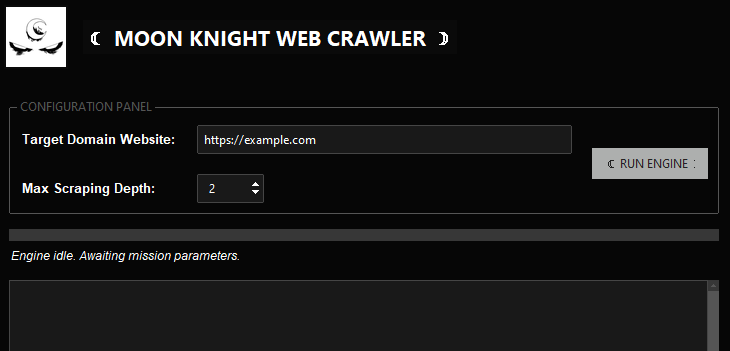

☾ Moon Knight Web Crawler ☽

A modern, multi-threaded web crawler with a GUI built using 
Tkinter + ttkbootstrap, designed for structured domain mapping and link 
discovery with a cinematic Moon Knight-inspired interface.

#UI preview

# Features
    Domain-Restriced web crawling
    Depth-based crawling control
    Mult-threaded execution (non-blocking UI)
    Real-time discovery queue tracking
    Download directory tracking for results
    Gui using ttkbootstrap
    Moon knight (favorite character) themed interface with custom logo
    Live loggin console inside the app
    Progress tracking system

#  Structure

SpyderBot/
│
├── main.py              # App entry point
├── gui.py              # GUI interface (ttkbootstrap)
├── crawler.py          # Web crawling engine
│
├── assets/
│   ├── moon_logo.png   # UI logo
│   └── app_icon.ico    # App icon
│
└── README.md

# How it works
    a. User enters a target url
    b. Crawler validates domain
    c. BFS-style queue processes pages
    d. BeautifulSoup extracts links
    e. New Links are added to queue
    f. UI updats in real time

# Requirements
    Python 3.13 was used (Pyython 3.x)
    Tkinter
    ttkbootstrap
    BeautifulSoup4
    Requests
    Pillow (image handling)
    Pyintaller (packaging) 
    Inno Setup Compiler (free) 

# Safety and Scope
    This web crawler is designed for:
        eductional use
        website structure mapping
        local testing environments
        Ethicial crawling only (respects domain boundaries)

#   Branding
    I used a Dark UI (black/charcoal base)
    silver/white accents
    cresent moon branding

# Installation Package

A pre-built Windows installer is available for users who do not want 
to run the application from source.

 ### What the installer includes
        Moon Knight Web Crawler executable
        Custom application icon
        Automatic asset installation (logo + resources)
        Desktop shortcut (optional)
        Start Menu entry
        One-click launch after installation
    
# HOW TO Install 
### Download the installer:
    `MoonKnightInstaller.exe`

    Run the installer (double-click)

### Follow the setup wizard:
    Click Next
    Choose install location (default recommended)
    Click Install
    Finish setup

### Launch the application:
    From Desktop shortcut OR
    Start Menu → Moon Knight Web Crawler

# System Requirements
Windows 10 / 11 (64-bit)
No Python required (standalone executable)
~50–150 MB disk space

👤 Author

Built by: Solothiel

